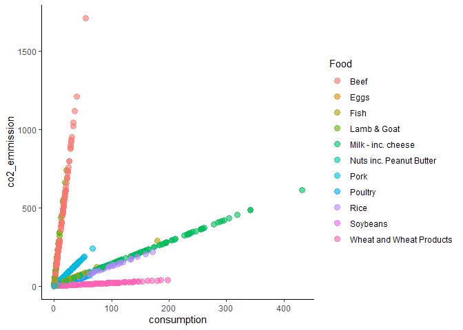

First Tidy Tuesday
================
Javiera Rudolph
2/18/2020

# Get the Data

``` r
food_consumption <- readr::read_csv('https://raw.githubusercontent.com/rfordatascience/tidytuesday/master/data/2020/2020-02-18/food_consumption.csv')
```

    ## Parsed with column specification:
    ## cols(
    ##   country = col_character(),
    ##   food_category = col_character(),
    ##   consumption = col_double(),
    ##   co2_emmission = col_double()
    ## )

``` r
# Load the libraries and if you don't have them installed yet
# install.packages('tidyverse')
library(tidyverse)
```

    ## Warning: package 'tidyverse' was built under R version 3.6.2

    ## -- Attaching packages --------------------------------------------- tidyverse 1.3.0 --

    ## v ggplot2 3.2.1     v purrr   0.3.3
    ## v tibble  2.1.3     v dplyr   0.8.4
    ## v tidyr   1.0.2     v stringr 1.4.0
    ## v readr   1.3.1     v forcats 0.4.0

    ## Warning: package 'dplyr' was built under R version 3.6.2

    ## -- Conflicts ------------------------------------------------ tidyverse_conflicts() --
    ## x dplyr::filter() masks stats::filter()
    ## x dplyr::lag()    masks stats::lag()

``` r
# Check how the data looks

food_consumption %>%
  ggplot(., aes(x = consumption, y = co2_emmission)) +
  geom_point()
```

<!-- -->

How many countries do we have?
